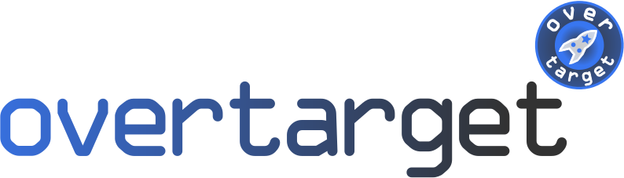

 
  

Overtarget is an eclipse plug-in that helps you managing your target platform files with dependencies across project boundaries.

## Project Status

Status    for *Development* build.

Status    for *Integration* build.

Status    for *Master* build.

## Purpose

If you have an eclipse project which is based on one of your other projects, you most likely have similar contents in the target definition files. When you are changing dependencies here, you often have to change them in both files.

Overtarget lets you define your dependencies in textual *.tmodel* file. Every change is directly compiled into a standard *.target* file. Similar to inheritance of classes you can create another *.tmodel* file for some other project and derive from the previous one. This way you only have to specify the changes such as added, changed or removed dependencies. All other dependencies are inherited and compiled into the local *.target* file.

## Requirements 

Overtarget is based on Java / Eclipse and provides an installable feature with plug-ins for your personal eclipse IDE. The following infrastructure is required:
 - Java Development Kit (JDK) 8
 - Eclipse Oxygen or newer
   - Including Checkstyle
   - Including Spotbugs
   - Including M2E
 - Maven 3
 - Windows 7 or Linux Computer

## Quickstart for users
If you just want to use Overtarget feel free to download it from the Releases section here on GitHub. A manual is provided as [PDF](https://github.com/DLR-SC/Overtarget/releases/download/development_snapshot/Overtarget_Documentation.pdf). 

## Quickstart

1. Open your Eclipse and switch to the Git Perspective.
2. Clone this repository.
3. Import all projects and working-sets via the ProjectSet file in _de.dlr.sc.overtarget/projectSet_
6. Execute the Overtarget build from _de.dlr.sc.overtarget/launchers_
7. Inspect the build artifacts for the p2 repository in _de.dlr.sc.overtarget.p2updatesite/target_

## Travis CI and Releases

Tarvis CI is set-up to start a build job for every branch and every new commit to the repository. It executes all relevant tests such as jUnit, SWTBot, Checkstyle, SpotBugs, etc. Making a successful pull-request into development requires all tests to pass.

Starting a Travis CI job on development or integration deploys all relevant artifacts.

For creating a new release, create a tag starting with *Release_* on the *master* branch. All artifacts are automatically deployed.

## Provided Features

Overtarget provides the following features:
 - Xtext based textual editor in eclipse for *.tmodel* files.
 - Xtend based compilation of *.tmodel* files to *.tagret* files. 

## Downloads and Deployment

Deployments are done using GitHub Releases as well as sourceforge: 

## Software Engineering Requirements

This project follows DLR Software Engineering Requirements for application class 1 as documented in the [Checklist](se_checklist_app_class_1.md).
 
## Contribution

To contribute to this project follow the given steps:

1. Create your own fork of the project.
2. Apply your changes.
3. Create a pull-request of your change to our development branch.

To increase chance that we accept your pull-request, make sure all tests are working. The best indicator is the Travis CI job. Next we will review your pull-request, give comments and maybe accept it.

## License

Copyright 2019 German Aerospace Center (DLR)

The German Aerospace Center (DLR) makes available all content in this plug-in ("Content").  Unless otherwise indicated below, the Content is provided to you under the terms and conditions of the Eclipse Public License Version 2.0 ("EPL").  A copy of the EPL is available at https://www.eclipse.org/legal/epl-2.0. For purposes of the EPL, "Program" will mean the Content.

If you did not receive this Content directly from German Aerospace Center (DLR), the Content is being redistributed by another party ("Redistributor") and different terms and conditions may apply to your use of any object code in the Content.  Check the Redistributor's license that was provided with the Content.  If no such license exists, contact the Redistributor.  Unless otherwise indicated below, the terms and conditions of the EPL still apply to this content.

## Third Party Licenses

Third party licenses are named in the plug-ins where used in the respective _aboutfiles_ folders. At runtime third party licenses can be viewed in the usual Eclipse About dialog. Also check out the [Notice](NOTICE.md) file.
